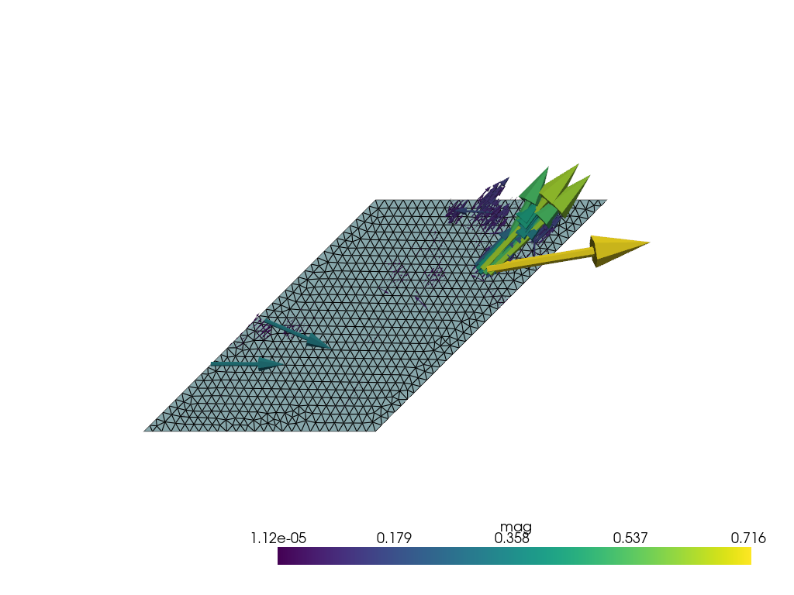
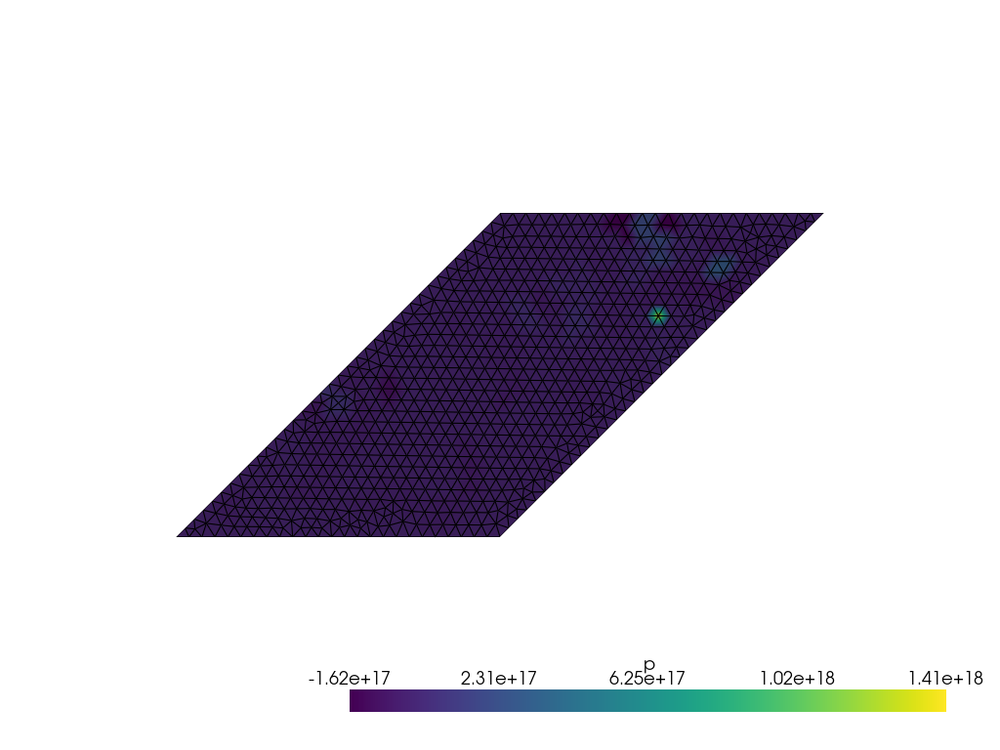

# Lid-driven cavity problem
Recreating the lid-driven cavity problem described in 6.2.1 [J.S. Hesthavena , S. Ubbiali, Non-intrusive reduced order modeling of nonlinear problems using neural networks]

## Weak form derivation
Problem setting

$$u, v \in V \qquad p, q \in Q$$

$$ -\nu \nabla^2u + u \nabla u + \frac{\nabla p}{\rho} = g$$

$$ \nabla u = 0$$

Test function, integration

$$-\nu v \nabla^2u + v u \nabla u + \frac{v \nabla p}{\rho} = v g$$

$$-\int_\Omega \nu v \nabla^2 u + \int_\Omega v u \nabla u + \int_\Omega \frac{v \nabla p}{\rho} = \int_\Omega vg$$

Chain rule

$$-\int \nabla(v\nabla u) = - \int \nabla v \nabla u - \int v \nabla ^2 u$$

$$ \int \nabla (pv) = \int p \nabla v + \int v \nabla p$$

Divergence theorem

$$\int_\Omega \nabla (pv) = \int _{\partial \Omega} pv\hat{n}$$

$$ \int_\Omega \nabla (v \nabla u) = \int_{\partial \Omega} v \hat{n}\nabla u$$

Combining the three above

$$-\int_\Omega \nu \nabla(v\nabla u) + \int_\Omega \nu \nabla v \nabla u + \int_\Omega vu\nabla u + \int_\Omega \frac{\nabla(pv)}{\rho} - \int_\Omega \frac{p \nabla v}{\rho} = \int_\Omega vg$$

$$ \int_\Omega q \nabla u = 0$$

$$\int_{\partial \Omega} \nu v \hat{n}\nabla u+ \int_\Omega \nu \nabla v \nabla u + \int_\Omega vu\nabla u + \int_{\partial \Omega} \frac{pv\hat{n}}{\rho} - \int_\Omega \frac{p \nabla v}{\rho} = \int_\Omega vg$$

$$\underbrace{\int_{\partial \Omega} \left(\nu v \hat{n}\nabla u +  \frac{pv\hat{n}}{\rho}\right)}_{\text{Neumann boundary condition: } \Gamma_N = \emptyset} + \int_\Omega \nu \nabla v \nabla u + \int_\Omega vu\nabla u - \int_\Omega \frac{p \nabla v}{\rho} = \int_\Omega vg$$

$$\int_\Omega \nu \nabla v \nabla u + \int_\Omega vu\nabla u - \int_\Omega \frac{p \nabla \cdot v}{\rho} + \int_\Omega q \nabla \cdot u= \int_\Omega vg + 0$$

Assuming $\nu = 1$, $\rho = 1$, $g=0$:

$$\int_\Omega \nabla v \nabla u - \int_\Omega p \nabla v  + \int_\Omega q \nabla u + \int_\Omega vu\nabla u = 0$$

## Results

Velocity             |  Pressure
:-------------------------:|:-------------------------:
  |  

## Useful links
* Stokes flow example https://github.com/Wells-Group/dlrbnicsx/blob/main/demo/stokes_flow_dlrbnicsx/dolfinx_stokes_flow.py
* Different stokes flow example: https://docs.fenicsproject.org/dolfinx/main/python/demos/demo_stokes.html